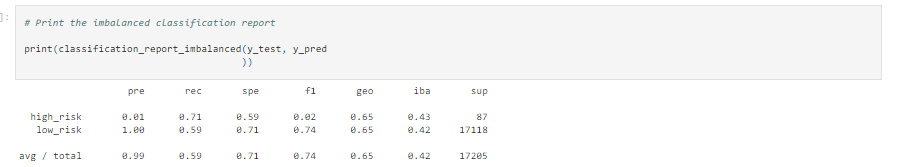

# Credit_Risk_Analysis - Challenge Number 17

## Overview of the Analysis

The purpose of this analysis was to assist the Fast Lending Company with preedicting credit risk of its borrowers by using machine learning.  By using algorithms we were able to manipulate the data and produce outputs which highlighted the risk for it's borrowers. 

## Results Based on Machine Learning Models

***

* Balanced Random Forest Classifier

As shown in the image below, the accuracy score for the Balanced Random Forest Classifier model was .79, or 79%.  

While the precision and recall scores for the Balanced Random Forest Classifier were slightly higher at .99 and .87 or 99% and 87% percent respectively. 

* Easy Ensemble AdaBoost Classifier

The second model we used, the Easy Ensemble AdaBoost Classifier produced a higer balanced accuracy score at .93 or 93% as depicted in the image below.      

The precision and recall scores were similar to those of the Balanced Random Forest Classifier model coming in at .99 or 99% for the precision score and .94 or 94% for the recall score.  

* Naive Random Oversampling

The balanced accuracy score for the Naive Random Oversampling came in much lower than the previous models at .64 or 64%.  

Similar to the previous models, the precision score for the Naive Random Oversampling model was .99 or 99%, while the recall score was much lower at .65 or 65%. 

* SMOTE Oversampling

The next model, the SMOTE Oversampling model produced a balanced accuracy score similar to that of the previous model at .63 or 63%.  

The precision and recall scores were also very similar to those of the previous model, coming in at .99 or 99% and .64 or 64% respectively. 

* ClusterCentroids Resampling

The ClusterCentroids Resampling model produced the lowest balanced accuracy score at .53 or 53%.  

The precision score ocne again matched that of the previous models at .99 or 99% while the recall score was much lower at .45 or 45%.

* SMOTEENN

The last model, the SMOTEENN model produced a balanced accuracy score of .65 or 65%.  While the precision score was .99 or 99% and the recall score was only .59 or 59%.    

## Summary 

In conclusion, based upon the data provided and the calculations, the best model to go with that has both the highest balanced score and precision and recall scores would be the Easy Ensemble AdaBoost Classification model.  It can be noted that higher the percentage the more accurate the results would be.  

